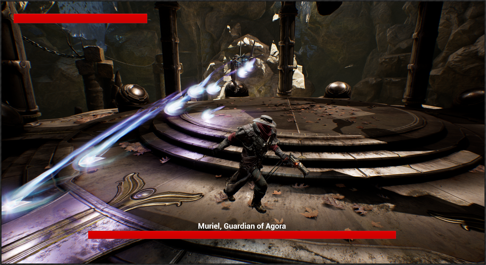

# UE4 Hack & Slash

A third-person hack & slash game developed with Unreal Engine 4.

## Project Setup

In order to run this game, additional content is needed from the Unreal Marketplace:

- Paragon: Minions
- Paragon: Muriel
- Paragon: Revenant
- Soul: Cave
- Starter Content

These will be referenced by the game, and must be present in order to load the
project. They are present in `.gitignore` to reduce the overall repo size.

## On Git LFS and BuiltData

While the game's map is only 9MB, the built level data is 310MB. This is well
above Github's 100MB limit on files, so Git LFS is necessary to clone the repo.
